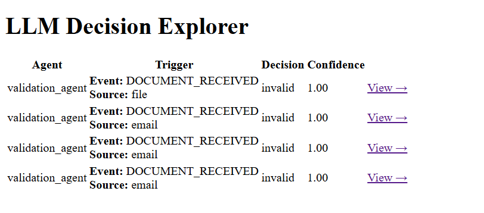

# LLM Agent Platform

An **event-driven AI agent system** that uses **LLMs for reasoning and decision-making**, with full **auditability, confidence scoring, and an LLM Decision Explorer UI**.

Designed event-driven AI validation pipelines triggered by file uploads and email ingestion, using LLMs and embedding-based semantic analysis to detect anomalies, inconsistencies, and schema drift—replacing brittle rule-based QA systems.

This project demonstrates how **LLMs operate as agents inside real workflows**, not just chat interfaces.

---

## What This Project Does

- Listens to **real events** (email, file changes)
- Automatically triggers **workflows**
- Executes **LLM-powered agents**
- Logs **LLM decisions with confidence & reasoning**
- Displays decisions in an **admin dashboard**

---


## How LLMs Are Used

Each agent follows a **hybrid approach**:

1. **Deterministic checks first** (rules, schema validation)
2. **LLM reasoning second** (judgment, explanation, suggestions)
3. **All decisions are logged**, including:
   - Decision (`valid / invalid`)
   - Confidence score
   - Reasoning
   - Suggestions
   - Event type and source (email / file)

This ensures **explainable and auditable AI decisions**.

**Tech Stack** 

- Python
- FastAPI
- PostgreSQL
- SQLAlchemy
- Ollama (LLaMA 3.1 8B)
- Watchdog

---

##  Example LLM Decision

```json
{
  "agent": "ValidationAgent",
  "decision": "invalid",
  "confidence": 0.91,
  "reasoning": "CSV missing required column: invoice_id",
  "trigger": "DOCUMENT_RECEIVED",
  "source": "email"
} 
```

This view shows all LLM decisions with confidence scores and triggers.



---

### LLM Decision Detail View

This view shows the full reasoning, confidence, input context, and suggestions produced by the LLM.


